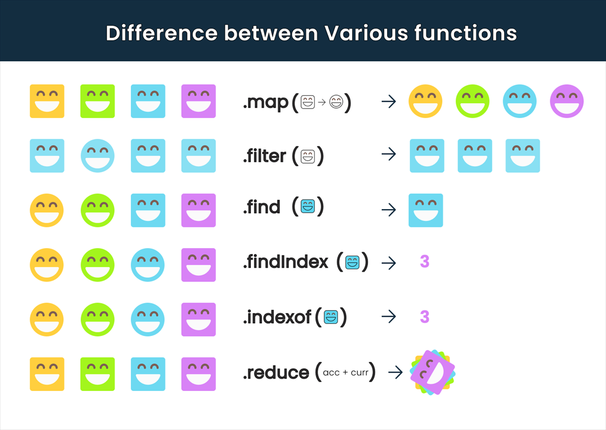

# Array 메서드


---
## fill()
- 배열의 시작 인덱스부터 끝 인덱스 이전까지 정적인 값 하나로 모두 채운다.
  ```js
  let arr = [0, 0, 0, 0, 0];
  arr.fill(5);  // 5로 전부 채운다. [5, 5, 5, 5, 5]
  arr.fill(5, 2); // 인덱스 2부터 5로 전부 채운다. [0, 0, 5, 5, 5]
  arr.fill(5, 1, 3);  // 인덱스 1부터 3 직전인 인덱스 2까지 5로 채운다. [0, 5, 5, 0, 0]
  ```
---
## filter()
- 주어진 함수의 테스트를 통과하는 모든 요소를 모아 새로운 배열로 반환한다.
- 기본 구조
  ```js
  Array.filter([currentValue],[index],[array])
  // currentValue ::  처리할 현재요소
  // index        ::  처리할 현재요소의 인덱스
  // array        ::  forEach 를 호출한 배열
  ```
- 주어진 배열에서 짝수만 반환하여 출력
  ```js
  // 배열 [1, 2, 3, 4, 5] 생성
  const numbers = [1, 2, 3, 4, 5];

  // filter()를 사용하여 배열 numbers의 요소 number에 대한 함수 테스트
  // '2로 나누면 나머지가 0이 되는 조건'이 true임을 통과하는 number를 모아 새로운 배열 evenNum에 반환.
  const evenNum = numbers.filter(number => number % 2 === 0);

  console.log(evenNum); // [2, 4] 출력
  ```
---
## map()
- 배열 내 모든 요소 각각에 대하여 주어진 함수를 호출한 결과를 모아 새로운 배열을 반환한다.
- 기본 구조
  ```js
  Array.map([currentValue],[index],[array])
  // currentValue ::  처리할 현재요소
  // index        ::  처리할 현재요소의 인덱스
  // array        ::  forEach 를 호출한 배열
  ```
- 배열의 각 요소에 2를 곱하고 출력
    ```js
  // 배열 [1, 2, 3, 4, 5] 생성
  const numbers = [1, 2, 3, 4, 5];

  // map()을 사용하여 배열 numbers의 각 요소 number에 대해
  // '2를 곱하는 함수'를 호출하고 각 결과값들을 새로운 배열 doubleNum에 반환
  const doubleNum = numbers.map(number => number * 2);

  console.log(evenNum); // [2, 4, 6, 8, 10] 출력
  ```
- 요소가 10개인 배열을 만들고 1~10 까지의 숫자를 할당
  ```js
  //  1. Array(10)으로 길이가 10개인 배열을 생성한다.
  //  2. fill()로 요소들을 undefined로 모두 채운다.
  //  3. map((_,index) => index+1)로 배열내 모든 요소 각각에 1을 더하는 함수를 호출한다.
  
  Array(10).fill().map((_,index) => index + 1);
  // 결과 : [1, 2, 3, 4, 5, 6, 7, 8, 9, 10]
  ```
---
## reduce()
- 배열의 각 요소에 대해 주어진 리듀서(reducer) 함수를 실행하고, 하나의 결과값을 반환한다.
- 리듀서(reducer)함수는 네 개의 인자를 가진다.
  - 누산기 (accumulator, 줄여서 acc 또는 a)
  - 현재 값 (current Value, 줄여서 cur 또는 c)
  - *(optional)* 현재 인덱스 (index, 줄여서 idx 또는 i)
  - *(optional)* 원본 배열 (array, 줄여서 arr)
- 기본 구조
  ```js
  Array.reduce([accumulator],[currentValue],[index],[array])
  // accumulator  ::  콜백의 반환값을 누적합니다.(누산기)
  // currentValue ::  처리할 현재요소
  // index        ::  처리할 현재요소의 인덱스
  // array        ::  forEach 를 호출한 배열
  ```
- 주어진 배열의 요소를 모두 더하여 출력
  ```js
  const mathValue = [66, 47, 89, 100, 23, 88];
  // 누산기 sum에 각 요소 element를 더하여 result에 할당한다.
  const result = mathValue.reduce((sum, element) => sum+=element);

  console.log(result);
  ```
  
